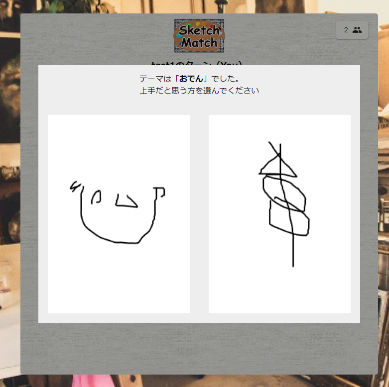

はじめまして、jonnityです。

ネット上での活動をもう少し真面目にやろうと思い立ち、ブログサイトを作成しました。
最初の記事であるこの場では、私とこのブログについて書こうと思います。

## このブログの構成について

まずは、このエントリの最低限の価値を担保するために、このサイトの構成の話をします([リポジトリ](https://github.com/jonnity/blog)もPublicにしてます)。

まず、技術スタックとしては以下のようになっています。

* Next.js (App Router)
  * SSG機能を利用
* Typescript
* Tailwind CSS
* Github Actions
  * ビルド/デプロイと最低限のテスト
* Cloudflare Pages

CMSサービスは利用しておらず、ビルドに必要な情報は全部Gitに上がってます。
なんらかのヘッドレスCMSを使うことも検討しましたが、似たようなことをローカルで閉じてやったほうが楽かもと思いそうしています。

その代わり、`/src/entries`にmdファイルを突っ込めばSSGで記事ページを生成するようにはしています。
`/src/util/entry/Entry.ts`でちっちゃいヘッドレスCMSを作ったようなイメージです。
それを使って`/src/app/blog/[slug]/page.tsx`で[`generateStaticParams`](https://nextjs.org/docs/app/api-reference/functions/generate-static-params)したりしてるのが、おおよそ全貌です。
md→htmlの変換のカスタマイズなどに不完全なところもありますが、自分しか書かないので、運用でカバー＆困ったときに直せばいいと思ってます (YAGNI YAGNIと唱えながら、「見出しに単純なテキスト以外を入れるとidがおかしくなる」こととかに目をつぶってます)。

front matterを用いて、各種メタデータもmd内で管理しています。
↓を設定可能にしており、mdファイルを読むときに、zodでバリデートするようにしてます。

* `title`: エントリのタイトル
* `createdAt`: 作成日時
* `updatedAt`: 更新日時 (任意)
* `tags`: タグ (任意)
* `thumbnail`: サムネイル情報 (任意)
* `description`: メタデータのdescription用 (その他の情報もメタデータに流用)

作る上で、[Front Matter CMS](https://frontmatter.codes)というものも見つけたのですが、これもまた他のCMSをサービスと同様に、自分ひとりでやるなら不要かなと感じました。
今のところは、せっかくmdで書くのに操作をGUIに寄せる必要性は感じていないので、この構成は結構ちょうどいいのかなと感じています (いっぱい記事書くと変わってくるのかもしれませんが)。

今のところ最低限の構成になっていて、エントリの数が増えていくと困るんだろうな～と思っていますが、困り次第修正していく予定です。

## jonnity (サイトの作者) について

↑である程度の価値を用意した上で、自己紹介もさせてください。

私は、エンジニアとして働いていて、分類はやや難しいですが、メーカー企業内のWebエンジニアとかになると思います。
ただ、仕事としてコーディングをすることは多くないです。

仕事以外では、概ね以下のようなことをしています。

* 個人開発
* 飼育しているアリの世話
* 漫画/アニメ/ゲーム
* Webメディア (主にDPZ/オモコロ) の記事読み
* 麻婆豆腐/ビリヤニ作り
* ゆゆ式視聴

個人開発では、また別記事にしようと考えていますが、今はパーティ系のボードゲームが遊べるWebサイトを作っています。
みんなで絵を書いて、それで神経衰弱をするようなゲームです。
そろったときには↓みたいに絵の上手さも競うルール。

左は鍋の絵です。おいしそうな卵とはんぺんですね。

ある程度遊べるようになってるんですが、ある程度遊べるようになったことでモチベーションが落ちて開発が止まっています。
モチベーションの維持のためにもこのサイトをにできるといいなと思ってます。

その前には、ポケモンカード公式のデッキ作成ツールの[デッキコードを管理できるツール](https://pokeca-deck-manager.com)を作ったりもしてましたが、ポケモンカードが全然買えなくて、カード自体をやらなくなりました。
なんか機能アップしかけて、そのままメンテしなくなってるので、一応動くけど…という状態だと思います。
じきに消えてなくなる気がします。

他に、珍しめの趣味としては、アリを飼っています。今のところ、一番好きなアリはアズマオオズアリです。
メジャーワーカー (兵アリ) の頭が大きいことが「オオズ (大頭) アリ」という名前の由来なのですが、それがややアンバランスでかなりかわいいです。

あとの要素は、今後特に触れられることはないかもしれません。
ゲームは積みまくってるので、その解消のためになにか書くことがあるかもしれませんが、おそらくここでパーソナリティを露出しただけで終わります。

## このサイトの目的

最後に、自己紹介パートでも少し触れていますが、このサイトを作った理由としては↓があります。

* エンジニアとしてのアウトプットの場が欲しかった
  * それによる個人開発のモチベ維持効果も期待
  * 単純になんらか知見を残して、それが誰かの役に立つことがあれば喜ばしいし
* アリ飼育を始めとしたその他雑記を残す場所も欲しかった
  * それを考えると、QiitaなりZennとかじゃなく、自分のサイトが欲しかった

次点で、単なる文章でない表現もできるようになりたいという気持ちがあり、とりあえずその可能性を消さないようにという意図もあります。
[中日新聞のQRコードのやつ](https://static.chunichi.co.jp/chunichi/pages/feature/science/galois_field_in_auto_factory.html)とかすごかった。
また、いずれは作ったものを紹介するポートフォリオサイトとしても運用していきたいというのもあります。

あとは、テキストメインのサイトを持って広告貼る権利を得られたらいいなとも思ってます。
ゲームとかWebアプリとかだと広告が貼れながち問題を、このサイトのサブドメインのサイトにデプロイすることで解消したい。

## ということで、よろしくお願いします

特にアリ飼ってる人

エンジニアには現実でも会えるけど、アリ飼ってる人にはほぼほぼ会えないので
