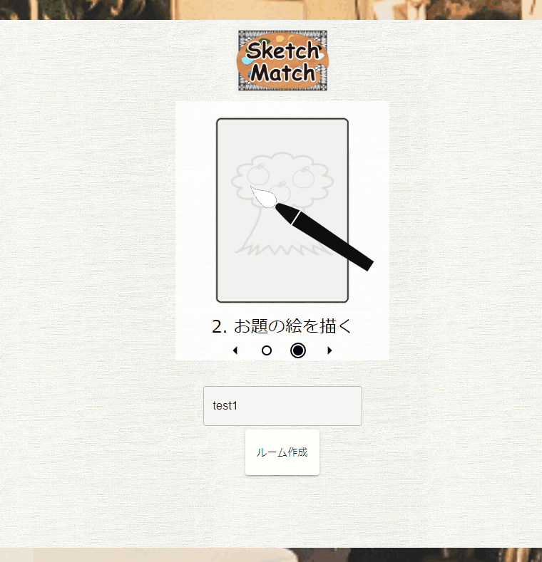

## 開発関連

ずっとやろうと思い続けていたルール説明の改善に着手した。


何個かのSVGアニメーションをカルーセル表示することにして、こんな感じ。

アニメーションは、[Synfig Studio](https://www.synfig.org)で作って[lottie](https://lottiefiles.com)に出力してる。
lottie出力の機能はPython製のpluginとして提供されていて、最初Pythonのせいでうまく動かなかったから、Pythonのことを少し嫌いになった。
(こういうトラブルシュートをエントリにすればいいんじゃんねと思ったので、きっとします。)

カルーセル表示も実装したから、あとはアニメーションをゴリゴリ作っていけば、いい感じのルール説明になるつもり。

---

## その他

なんか作った巣がアリたちに不評がちだった。
アシナガアリに作った巣は使ったケースの密閉性が足りなかったのが、まったく居着いてくれなかったので、取り外した。
クロオオアリは、使ってくれてるけど、すごい掘ってる。掘らないでほしい。

今シーズンはアシナガアリは来シーズンはじめでお引越しすればいいかしらと思い始めてる。

---

[Slay the Spire](https://store.steampowered.com/app/646570/Slay_the_Spire/)はサイレントでA6までクリアするなどした。
このゲーム、人生らしい。ソースは永田智。

---

[Inscryption](https://store.steampowered.com/app/1092790/Inscryption/)を始めて、怖かったから怖くなくなるまでぶっ通しでプレイした。
怖くなくなってからパートはまだまだこれからやる。

## 8月の肉じゃが

```twitter
1818994661765349765
```

↑スパニッシュオムレツ崩し (←ルチャリブレの技みたい。知らんけど)

```twitter
1825110558682788244
```

↑多分無水

```twitter
1828383361985061206
```

↑ポーチドエッグが乗っているのでおしゃれ

```twitter
1829131195864756657
```

↑甘酢がかかっているのでおしゃれではない

```twitter
1829815908321411405
```

↑皿の中央に盛り付けられていないのでおしゃれ
