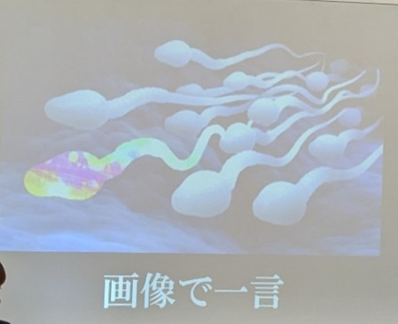
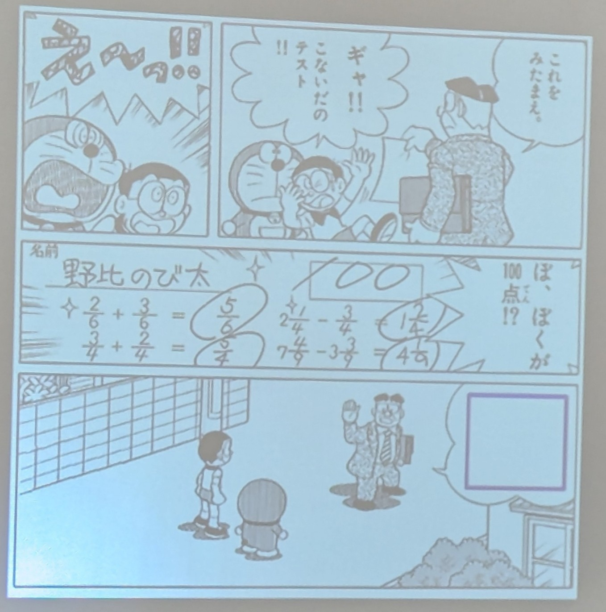
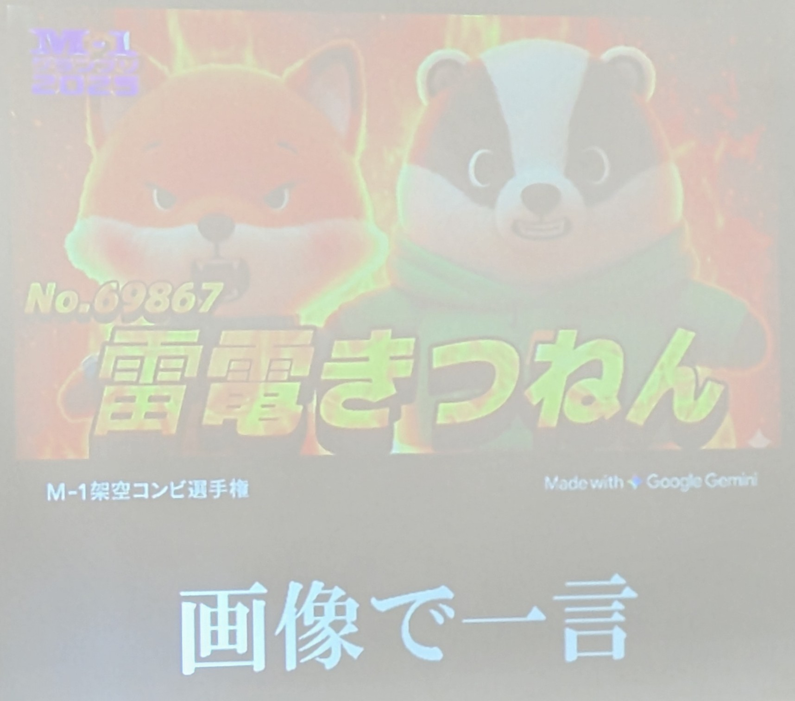
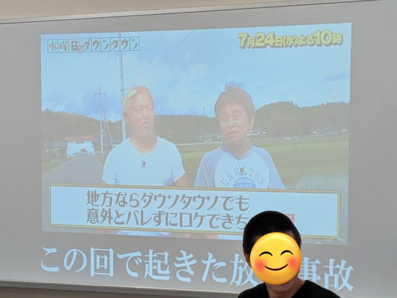

## 大会概要

[余馬](https://x.com/extra_horse)さん主催の印象の大会: [第11回大喜利抜刀杯(関西最終回)](https://twipla.jp/events/702885)

## 結果・感想

なんと優勝できたので、しがみの前に節を設けて感想も書かせてください。
ということで優勝できたのですが、↓のしがみ/各お題の感想とかをM-1を見つつでまとめ終わって、この節を書いている今 (12/21 23:00頃)、まだちょっとふわふわしています。
優勝決まった瞬間が一番ふわふわしてて、ふわふわが減っていってるのでもうすぐふわふわがなくなって、そこに実感が湧いてくるかもと思ってます。

ただ、大喜利してるときは、決勝含めて緊張とかもあんまりなく (これはいつも)、集中できてて (これは疲れもあって集中切れてたかもってなることも多かった) よかったです。
準決勝、決勝ともに、苦手意識のある芸能お題っぽいものが多くひょえ～と思いつつでしたが、そのへんをいなして芸能じゃないところに注目してウケることができてよかったです。
この辺をなんとかするのは、大喜利をさらに楽しむためには必須だよな～と思ってたところだったので、めちゃめちゃ嬉しい。

あとは、前回 (関西での) の大喜利抜刀杯で、生大喜利では初めて、大喜利関連で勝つことを体験していましたし、余馬さんのお題との相性みたいなものもある気はします。
少し込み入ったものを読み解けるとよかったり、回答者側で込み入った内容を言いやすかったりするのはかなりありがたいです。
東京に行ってしまうとのことですが、ぜひ機会があればまた余馬さんの大喜利回に参加したいです。

優等生的なことも書いておくと (ほんとに思ってます)、生大喜利意識調査2025でけっこう新人として注目していただいていていた最中の出来事だったので、名前挙げていただいた方々の目に狂いがないと証明できたことも含めてとっても嬉しかったです。

あと、ついでに自分語りすると、意識調査で私について「最初からよかった」と言ってくれている方と、「徐々に良くなってきた」と言ってくれている方がいるのがおもしろかったです。
多分これは、着眼点とかは最初から面白かった (というか変だった) んですが、それをちゃんと面白い形で回答として出すことがだんだんできるようになってきているということな気がします。
生大喜利を始めた瞬間からまだまだどんどん大喜利が楽しくなってきていて、色んな場面でいっぱい大喜利したいし、大喜利で知り合った皆さんが大好きなので、なんでもバンバン誘っていただけると嬉しいです。

## 予選 Aブロック

### 他の教師たちからあのクラス治安良いなと思われたくて頑張ってる担任

* れんじあ「(小声で) この声が聞こえる状態で授業します」
* 粉骨「今日の表彰台誰ですか」
* 松竹梅ぱくぱく「警察係、逮捕お願いします」
* 粉骨「自分の教科の時間で好きなだけ暴れさせる」
* うすくち「机に机用のくつしたを履かせている」

MCでも少し言及されてましたが、「他の教師から治安良いと思われたい」という不純さみたいなものがこのお題のちょっとひねられたポイントだと思うので、そこがうまいと嬉しかったです。
その意味で、↑の粉骨さんの「自分の教科の時間で好きなだけ暴れさせる」は、「他の教師から」ポイントが完璧に伝わってすごかった。
松竹梅ぱくぱくさんの「警察係、逮捕お願いします」もかなり好きです。発想がめちゃめちゃ面白いのは前提として、治安維持が生徒側に任されてる (警察係を設けている) のに結局は先生が逮捕をお願いしているという点で、「思われたさ」もバッチリな気がしてきました。

### 任天堂の暗黒期【〇〇〇時代】

* 五能ファイア「名作なし時代」
* うすくち「花札大アレンジ時代」
* バームク「AボタンBボタン一緒時代」
* 松竹梅ぱくぱく「マリオ体調不良時代」
* うすくち「ソリティア大流行時代」
* 松竹梅ぱくぱく「オフィス工事中時代」
* バームク「ゲーグ時代」
* れんじあ「カービィ少食時代」
* うすくち「ドクターマリオ免許停止時代」
* 粉骨「ワザップ収益化時代」
* バームク「ニンテンドッグス頼む！時代」

バームクさんの「ゲーグ時代」が、余馬さんが「ゲームを作りたいのにゲーグができちゃう」みたいなこと返したことで徐々に笑いが大きくなっていってた記憶があります。嘘だったらごめんなさい。ここ、後から書いてるので、嘘の可能性ある。
松竹梅ぱくぱくさんの角度違う感じ、かなりいい……好きです。

### 図工室で少しエロい雰囲気になってしまった場面

* バームク「(カーテン全部閉めよっか) 暗すぎるって！」
* 松竹梅ぱくぱく「あいつら準備室いるの長くね」
* 五能ファイア「お前が俺の作品だぁ」
* バームク「(かざってあるの俺の絵なんだけど) 俺の絵の前で、どう？」
* 五能ファイア「力抜いて、あっごめん触っちゃった。そのまま力抜いとける？」
* 粉骨「(新品の図工の教科書を開くとき) メリッ」
* 松竹梅ぱくぱく「(なにがしたいのって話なんですけど) 先生は当分戻ってきません」
* 五能さんがキスして、唇の震えを止めてた
* バームク「(ああ！ああ！ああ！) 完成だぁーーー！」

こういうお題の五能さん見るの本当に好き。「そのまま力抜いとける？」←変すぎる。
松竹梅ぱくぱくさんの「あいつら準備室いるの長くね」もすごい。

### ナダル「イッちゃってる」神様「ナダルよ、何がイッちゃっていると言うのだ」ナダル「〇〇〇」

* 五能ファイア「ナダルがイッちゃっております」
* 五能ファイア「神様、てめぇだ！」
* バームク「時間が (?)」
* 粉骨「電車が東京から埼玉に」
* 松竹梅ぱくぱく「信じてください」
* バームク「南の空のあたり」
* 松竹梅ぱくぱく「イッちゃってるからこうなってんねん」
* 五能ファイア「ほんとにイッちゃってたら、こんなにまともにしゃべれてません」
* バームク「質問を質問で返すな (?)」

五能さんの「ナダルがイッちゃっております」は初答 (全体の初答だったと思う) として完璧ですごい。
粉骨さんが顔芸に行ってしっかりウケてて、エンターテイナーが過ぎていました。素晴らしい。
バームクさんの「質問を質問で返すな (?)」もかなりすごいですね。「何がイッちゃってるのか」聞かれているので、正当に返すなら単語とかで答えることになると思うんですが、「イッちゃってる」という表現を使わずに、質問されたというフォーマットだけで成立してるセリフ。お題の字面を見てても、ナダルと神様の会話をリアルに想像しても思いつかなくないですか？

## 予選Bブロック

自分のとこ

### のび太以外全員から嫌われているジャイアン

* 「(ジャイアンっぽく) ドラえも～ん」
* 「のび太も剛田商店のことが好きなだけ」

とか言ってた。優勝の衝撃であまり記憶がない。

### 自認が「教育番組のお姉さん」の女オタク

* 「ダンスサークルに入ってみたけどなんか違った」

とか答えてたけど、いまいち「教育番組のお姉さん」の感じがわからないまま終わってしまった。難しい。

### マイナーなアニメのWikipediaにあった、客観性に欠ける一文

* 「夕方の放送ならもうちょっと違った」
* 「マイナーじゃない」って答えた直後にペドラザさんが横で「マイナー」って答えてて面白かった

みたいな感じ。こういうお題本当に楽しい。

### 自分がトイレに行ってる間にめちゃめちゃ盛り上がってた関暁夫「◯◯◯」

* 「しっこみたいな時間で、うんこしてきたんだよね」がめっちゃウケた
* 「トイレの都市伝説、思いつきました」とも言ってた

関暁夫ほぼまったく知らんけど、口調だけやって、注目集めようとしてる感じで主にやってたと思います。
「トイレの都市伝説、思いつきました」は、けっこうみんなずっと「◯◯なんだよね」って言われ飽きてるかなと思って、割と意図的に口調を普通にして都市伝説をいじってみたりできたから良かったと思う。

```twitter
2002260387098759607
```

↑なんかあるとさんがしてくれたしがみポストもめっちゃいいねされてておもろい

## 予選Cブロック

### サッカー部にいるマジで何考えてるのか分からない部員が急に喋ったこと

* かにスープ「蹴った？」
* ウシキヨ「愛って心を受け止めるって書くよな。俺もゴールキーパーとしてそうしたいよ」みたいな回答
* ウシキヨ「肩にちっちゃい重機乗せてんのかーい！ボールを乗せろよな」
* 麓「スポポポポンツドリンク。ごめん、盛り上げようとしたんだ」みたいな回答

ウシキヨさんのぼそっと言う感じも、麓さんの急にめっちゃ喋る感じも面白かったです。

### 老人からすると藤井聡太はこう見えてる

* かくれどり「うでとあしが足して16本ある」
* かにスープ「角行」
* かにスープ「二歩」
* あると「全員の孫」
* かにスープ「年下やったんや」
* にこごり「ゲーム小僧」
* あると「５年後の自分」

どう面白くするか難しそうな感じでした。かにスープさんの「角行」とか「二歩」とかのシンプル将棋ワードからの「年下やったんや」が最高でした。

### 明らかに多い情報量を無理やり５７５に収めてグチャっとなってる川柳

* 麓「はらじゅく　ぐしけんようこう　交通違反」
* あると「ビームセイバーを持ってるあなたかな」
* かくれどり「情報量　ぎゅっぎゅっ　はぁはぁ」
* ウシキヨ「ボーリング　地質調査の　ボーリング」
* 麓「オギャったら　お前ら全員　許さないズラ」

グチャッと感は麓さんがかなり上手だったように思います。

ウシキヨさんは「情報量の多さ」のすかし方が上手くて、華麗な抜け道って感じだった気がします。「サッカー部にいるマジで何考えてるのか分からない部員が急に喋ったこと」のお題でもですが、ウシキヨさんの感じがばっちり出せると、無限に見てられる感じがします。
あとは、個人的にはいい感じに破調させてほしいな～と思って見てたので、↑のあるとさんのやつはうれしい。期待した感じを出せるのいいですよね。

### 手も足も出せずに一方的にボコボコにされてるベジータの悲しい一言

* 麓「涙はしょっぱいのかー！」
* ウシキヨ「ビンゴ！ビンゴ！ビンゴでバトルしよう」
* にこごり「朝は平和だったのに」
* かにスープ「カカロット、お願いします」
* あると「モンキーDルフィ、その名前覚えたからな」
* 麓「あの木に隠れてればよかった！」
* あると「色の判別がつかない」
* にこごり「それがベジータへの態度か」
* ウシキヨ「肩パッドを忘れてこなければ」

このお題の麓さんが大爆発してました。「あの木に隠れてればよかった！」面白すぎる。
二周目 (後ろ２つのお題) は、↑もこのお題も麓さんめっちゃよくて、40票以上を取ってて凄まじかったです。。

## 予選Dブロック

### ベテラン漫才師の、仕事が完全にゼロだった年の様子

* あっきーな「五分に一回スマホ確認する」
* 小濱「孫にワードをもらっている」
* みずやま「友近を食事に誘って断られた」
* あっきーな「こいつのアカウントが10個くらいできて、全部本物」
* ところざわ「Threadsで未亡人のふりをして満たされる」
* ところざわ「一年かけて、あつ森でお笑いユートピアを作る」
* ところざわ「女芸人の出待ちをして、キャバ代を浮かせた」

ところざわさんが活き活きしてて最高でした。あっきーなさんの悲しいリアリティもかなりよかった。

### 関根勤とあなたの関係を教えてください

* カレー「ドンキーとディディーコングとまったく一緒」
* 小濱「なんか昔小学校に来た」
* あっきーな「お互い画像で知ってる」
* みずやま「関根勤が体調悪いときは俺は体調がいい」
* ところざわ「小学生の頃すれちがい交換日記で喧嘩した」
* カレー「関根勤は美容室で俺の写真を見せている」 (カレーさんは超短髪ということも含め)
* 小濱「イマジナリーフレンド」
* カレー「関根勤は助手席に俺がいないと運転できない」
* 小濱「夜用ぬいぐるみ」
* みずやま「ポストにカラスの死骸を入れられたこともあるし、入れたこともある」

ある程度出きった感があるときに小濱さんの「イマジナリーフレンド」が炸裂してて凄まじかったです。
あっきーなさんの「お互い画像で知ってる」もすごい。関根勤の画像が出てる状態ゆえにめちゃめちゃ面白い気がするから、そのへんの感覚もすごい。

### 画像で一言



* カレー「俺が終わらせるー！」
* あっきーな「みんなもこんな感じだったからね」
* あっきーな「出来レースじゃねぇか」
* カレー「下馬評どおりー！」
* カレー「お父さんの期待に応えたい」
* 小濱「後ろの方」
* ところざわ「これを恥ずかしいと思うこと自体、恥ずかしいからね」
* カレー「ここは俺の得意なコース」
* 苑苑「(みんな思ってるんですけど) 自分だけを見てほしい」
* カレー「楽しい未来楽しい未来楽しい未来楽しい未来……」

カレーさんが大爆発していました。「ここは俺の得意なコース」めっちゃ好きです。
カレーさんが勢いで流れを持っていっている中で、小濱さんが「後ろの方」で静かに大ウケするのかっこよすぎました。

### ナルシスト大喜利プレイヤー「カイト」が大喜利の大会に提供したお題

* ところざわ「俺の瞳に写ってるお前、誰？」
* あっきーな「カイトが二人写ってる画像」
* みずやま「カイトと中華料理が逆の世界」
* 小濱「青すぎた空、なぜ？」
* 苑苑「(単語の穴埋めお題で) カ◯ト」
* あっきーな「こんな学校早く終わらせてお前らに会いたい」
* 苑苑「カイトが野球部に入ったらどう思う？」
* 小濱「俺とお前でタイマン、どう？」
* カレー「(お題とかじゃなくて) Mission! カイトを楽しませろ！」
* ところざわ「ママに作ってもらっている」
* あっきーな「あまりにも楽しんごに酷似している殿様」
* カレー「(カイトが運転してる車がこっちに向かってくる画像で) 逃げる？」

小濱さんの「青すぎた空、なぜ？」の、「ナルシスト大喜利プレイヤーが作ったお題」としての納得感すごすぎる。
自分自身をお題にしちゃうって形でも、苑苑さんの「(単語の穴埋めお題で) カ◯ト」くらいシンプルなのと、カレーさんの「(カイトが運転してる車がこっちに向かってくる画像で) 逃げる？」くらいパワーあるやつめっちゃ面白かったです。

Dブロックの二周目でもカレーさんが41票とか取っててすごかった。

## 予選Eブロック

### 米津玄師がやってる再現性が低すぎる作曲方法

* トドのつまみ「Lemmonを聞き直す」
* 特効さん「猿に似たあのちゃんにキーボードを叩いてもらう」
* 捕鯨船「朝一番のうんちに超音波を当てる」
* トドのつまみ「いっぱいくじ引きする」
* 3104「パンツを引っ張り出してブリーフならド」
* 宇多川どどど「ジャクソン５の曲をちょっと変える」
* 特効さん「ブリンバンバンボンからンを抜く」

「再現性が低すぎる」の解釈が難しそうな感じではありました。
おもしろいランダムさ発生方法見たいな方向性は一つあって、その中で、3104さんの「パンツを引っ張り出してブリーフならド」が変で好きでした。パンツ複数種混ぜて使ってる人あんまいなくない？
捕鯨船さんの「朝一番のうんちに超音波を当てる」は何なんですか？あと、特効さんの「猿に似たあのちゃんにキーボードを叩いてもらう」がみんな「ん？」ってなったあとにウケてて怖かったです。休憩中に「あのちゃんに似た猿なら普通じゃないですか？」って言ってました。いうほど普通か？

### 俺は◯◯◯が好きなんじゃなくて、△△△が好きなだけだったんだ・・・

* トドのつまみ「時計/時間」
* 特効さん「パリ/かっこいい二文字」
* トドのつまみ「明太子/ご飯に何かを乗せる」
* 特効さん「平和/弱い自分でも生き残れること」
* トドのつまみ「お笑い/ほんこんさん」
* 宇多川どどど「たけし映画/スーツの男たちが仲良くしてるの」
* トドのつまみ「宇宙や恐竜/勝手に色々想像するの」

トドのつまみさんの「時計/時間」がかなり好きでした。その後も「お笑い/ほんこんさん」でめちゃめちゃ笑いました。すごい。
このお題のトドのつまみさんの回答、どれもそんなわけ無さが強くて面白かったのかなと思いました。

### 警察学校の教科書ではピーポくんについてこんな記述がある

* 特効さん「人間では伝えられなかったことを言語化することに長ける」
* 捕鯨船「女装させたらスゴイ」
* トドのつまみ「実は、ピーポくんの声優は元犯罪者」
* 宇多川どどど「服は来ておらず、全身が自身の肉体である」
* 3104「愛すべきバカ」
* 特効さん「命名者は坂本龍一」
* 特効さん「ウルフルズの元メンバー」
* トドのつまみ「ピーポくんを捕まえたら100万円」
* 3104「(吹き出しで) 僕はもう大丈夫だから」

トドのつまみさんの「ピーポくんを捕まえたら100万円」めっちゃ面白かったです。警察のマスコットの警察内での説明としていいわけなさすぎる。

### 画像穴埋めお題



* 捕鯨船「ノビは愛を知ったんだな」
* 宇多川どどど「リアクションも100点だねぇ」
* トドのつまみ「こういうこともあるよ」
* 3104「気持ちいい算数をするね」
* 3104「テクいねえ」
* トドのつまみ「二度とこんな点数取るなよ」
* 宇多川どどど「アディオス、満点ボーイ」
* 特効さん「また、テストを受けに来てください」
* 捕鯨船「今日の夜ご飯はお腹いっぱい食べていいぞ」
* トドのつまみ「このことは先生との秘密だよ」
* 特効さん「いままでバカにしてきてごめん」
* バケツマン「学校でまた急に出会おうな」
* 宇多川どどど「バーガーキングのセットなんですけど、ドクターペッパーのLでお願いします」
* バケツマン「事実」

宇多川どどどさんの「アディオス、満点ボーイ」、特効さんの「また、テストを受けに来てください」が特に好きでした。捕鯨船さんの「今日の夜ご飯はお腹いっぱい食べていいぞ」も、一瞬普通に面白いかと思ったら「先生が？」ってなって二段で面白かった。
トドのつまみさんの回答は、どれもわかりやすくつっこみやすくて、気持ちいいですね。

## 予選Fブロック

### ChatGPTが思うような答えをくれなくて、痺れを切らしたおばさんが送った文章

* たくめシャーマン「次口答えしたら「呪呪呪」」
* ラスター「あなたの奥の方にある賢さを全部出しなさい」
* marre「アメリカの賢い人に電話して」
* たくめシャーマン「私にも感情がありません」
* ラスター「荷物まとめなさい」
* 北山「もっと、して」
* marre「おばさん座ってたけど、立ったからね」

文章なせいでおばさんっぽさを出すのがちょっと難しいのかなと思ってみてました。
その中で、marreさんの「アメリカの賢い人に電話して」「おばさん座ってたけど、立ったからね」は完全におばさんでめっちゃ面白かったです。

### 小６男子グループが下級生について語り合ってるときの一言

* marre「(鋭いやつが) 中１から見た俺等」
* 出雲螢「1・2年生には生活って教科があるらしい」
* ラスター「いやそれ俺の弟ー！」
* ラスター「それも別の弟ー！」
* ラスター「(俺の弟もう全部言ったな) いやそれ小１のときの俺ー！」
* marre「(嘘なんですけど)俺下級生のとき裸足やったから」

ラスターさんが完璧な道を見つけて、完璧に歩んで言ったのが最高でした。

### 明確に「人生二周目キャラ」として描かれてるタラちゃん

* ラスター「磯野家のこの感じがすきですぅ」
* 出雲螢「育ち盛りの僕に高い靴を買うのは悪手ですぅ」
* 北山「タイコおばさんは、本当になにもしていないなぁ」
* 出雲螢「(急に声が低くなって) サザエ、今、絆されたな」
* ラスター「タラちゃんが裸になったとき、背中に羽の跡みたいなアザがある」
* たくめシャーマン「(意味深なんですけど) マチコおばさんと遊んでくるです」

人生二周目、難しそうですね。でもめっちゃやりたい。

なんとなくの、その感想になる？っていう感じが出せててラスターさんの「磯野家のこの感じがすきですぅ」とか好きでした。

### 画像お題



* marre「ここから画像が動いてミルクボーイに変わる」
* Ikoriha Yimiran「一回戦に三回出てる」
* Ikoriha Yimiran「準々決勝をコロナで欠場した」
* たくめシャーマン「せり上がりではまだ檻に入っている」みたいな回答

動物が何というイメージがあんまり一致してなかった気もする (パンダかたぬきか？とか) ので、素直にM-1要素をいじったIkoriha Yimiranさんの↑が面白いように感じました。

## 準決勝A

### HIKAKINの動画のコメント欄で見かけて、「もしかして脱がせようとしてる？」と思ったコメント

* 「虫がブンブンって服に入っていきましたよ」
* 「みそきん着てください」

とか言ってました。HIKAKINのこと一切見たことなくて苦手意識あったけど、この辺をいなせるようになっただけでかなり大喜利が楽しい。

### お尻が一言←このお題はジャンルで言うと何お題？

お題面白すぎる。

* 「もえ擬人化お題」
* 「おならお題」

とか言ってました。会心のおなら。

## 準決勝B

### ゲームフリークがテスト用にポケモンのデータ素材で作っためちゃくちゃ適当なゲーム

* あっきーな「床とか壁が全部腕組みしてるタケシ」
* カレー「イワークを並べてタケシを作ろう (絵)」
* 特効さん「モケットポンスター」
* 特効さん「(ピカチュウつーかまえた。つかまっちゃった)じゃあ行こうか」

データ素材だけなので、ポケモンの要素拾っても難しいようにも感じつつ見てました。
それゆえに、あっきーなさんの「床とか壁が全部腕組みしてるタケシ」がめっちゃ面白かったです。

### お題「ラーメン屋みたいな小学校」回答「道徳マシマシで」ズレてるツッコミ「◯◯◯」

* 特効さん「食いすぎやろ」
* カレー「おい！声小さいねん」
* たくめシャーマン「ロットを乱すな！」
* あっきーな「メッセージ性が強すぎる」
* トドのつまみ「あ～通いたい！」
* たくめシャーマン「(次の回答は) どう被せるのか」
* トドのつまみ「私学？」
* 特効さん「家庭科でもいけるやつやん」
* たくめシャーマン「あいよぉ！っておい！！」
* トドのつまみ「(あはは) 道徳って言葉がこんなに面白くなるとは」
* ラスター「くりかえせ！」
* たくめシャーマン「僕もこの人と同じやつで」
* 特効さん「(じゃあ俺おふざけマシマシで！) ごめんボケちゃった」
* たくめシャーマン「昼飯がそれだったの？」
* 特効さん「わかりました。うけたまわりました。」

トドのつまみさん通してと、特効さんの「家庭科でもいけるやつやん」あたりがかなり好きでした。たくめさんのもズレてるまわしくらいの解釈での回答も上手で面白かったです。

## 決勝

### (↓の画像で) この回で起きた放送事故



* 「肥溜めという肥溜めすべてに小学生がはまっていた」
* 「(田舎すぎて) 日本語が通じなかった」

とか言ってました。
水曜日のダウンタウンもほぼ見たことなくて、ダウンタウンのモノマネ芸人がいることも知らなかったがゆえに、田舎、放送事故という方向に行けてよかったかもしれません。


### 出囃子が鳴って舞台上に出ていく直前に相方にこんなことを言われたら意味不明すぎてネタを飛ばしてしまう

あるとさんに全回答 (多分) しがんでもらえててヤバい。↓を見てください。

```twitter
2002284733745762612
```

「頑張れよぉ！」は割とロジカルに (お前もだろという) 考えて出せた。
「いま3アウトだから、ここで負けたら4アウトだぞ！」も後がない感じをイメージしてうまいこと回答にできた感じがします。

あとは正直、脳内単語ガチャの出目が良かったという麺も強いです。でも「鏡よ鏡、俺たちが一番面白いのはだ〜れ？」は自分でもかなり好きかも。破綻してる日本語ってかなり面白いから。
