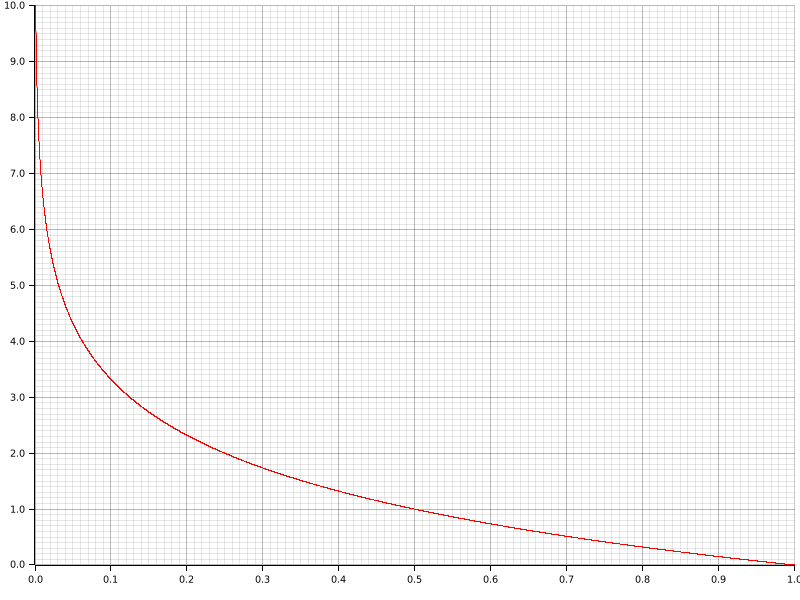

私は、地方に住んでいることは情報量が多いなと感じることができる。一般に「東京の情報量」というと、「東京に住んでいると (気軽に) 摂取できるコンテンツの量」くらいの意味なことが多い。そういう意味なら当然、地方には情報量が少ない。
いま考えたいのは、「他者に自身の居住地を伝えた際に、どれほどの情報が伝わるか」ということ。

というのも、最近、大喜利会に参加していて、Xの投稿をちゃんと見れば私が日本のどのエリアに住んでいるか分かるようになっている。
そうなったとき、居住地が明かされることが持つ情報量について考えたくなったので、考えをまとめてみる。

(ネット上の知らない人 (悪人を含む) に対する匿名性について考えたいだけで、そんなに気にしてないです。)

### 「東京に住んでいる」ことは驚きが少ない

まずは、「日本人がランダムに一人出てくるガチャガチャ」みたいなものを考えてほしい。
でっかいガチャガチャの全景を想像した人は不正解。あなたも入りなさい。天皇陛下とかに回してもらいましょう。恐縮です。

このガチャガチャから東京に住んでいる人が出てきても、「またかよ」と思う。
一方で、鳥取の人が出てきたら、「鳥取って砂しかないんじゃないの！？」と驚くことになるだろう。
こんな感じで、「東京に住んでいる人は多いので、東京に住んでいると聞いてもなにも思わない」という感覚を共有しておきたい。

そして、この感覚を定量的に扱うために、これらの事象が持つ「情報量」というものを数学的に定義したい。これはクロード・シャノンというすごい人がもうやってくれている。
確率変数$X$が取る値$x$について、情報量 (自己情報量) $I$は以下のように定義される。

$$
I(x) = - \log_2 P(X = x)
$$


確率が0に近づくと無限大に発散し、確率が1だと0になる

プロットするとこんなグラフになり、確率が低いほど値が大きくなっていることがわかる。

先ほどの東京と鳥取の例で具体的な値を計算してみる。
令和７年１月１日付の「住民基本台帳に基づく人口、人口動態及び世帯数」 (総務省、[ここにある](https://www.soumu.go.jp/main_content/000892947.pdf)) によると、日本の総人口が1億2,433万690人、東京都の人口が1,400万2,534人、鳥取県の人口が53万4,003人となっている。
なので、「東京都在住である」ことの情報量は以下のように3.15ほどに、

$$
- \log_2 \frac{14,002,534}{124,330,690} \approx 3.15
$$

「鳥取県在住である」ことの情報量は、以下のように7.86ほどになって、

$$
- \log_2 \frac{534,003}{124,330,690} \approx 7.86
$$

「東京都在住である」ことの情報量 < 「鳥取県在住である」ことの情報量になっている。

大小関係だけでなく、3.15だとか7.86だとかの数字が大きいのか小さいのかというのも考えてみたい。
ただ、絶対的に言えるようなものではないので、日本人の居住地というものが持つ平均の情報量を考える (これをエントロピー $H$ という)。

$$
H = \Sigma_x I(x)P(X=x)
$$

ここまででも考えていた日本人の居住地で計算すると、4.98ほどになる。
この値を基準に考えても、「東京に住んでいる」ことは大した情報ではなく、逆に、「鳥取に住んでいる」ことはある程度の情報だと言えそう。

```adsense
```

### 個人を特定するには？

次は、単に「ガチャから出てきたのが誰か」ということに着目してみる (=ガチャの中身を多数の「東京人」ではなく、ユニークな「山田太郎」とかにする) 。

こうなると、最近の個人を尊重する流れにも乗れるし、それぞれに同様に驚きがあることになる。
つまり、特定の「山田太郎」であることの情報量は、

$$
- \log_2 \frac{1}{124,330,690} \approx 26.89
$$

となる。

この数字の解釈として「それぞれ独立で日本人を２等分できる質問を27回答えさせれば個人を識別できる」と言える。
この「それぞれ独立で日本人を２等分できる質問」による特定を目指すとき、東京都在住という情報は３質問相当の情報にしかならないのに対し、鳥取県在住という情報は８質問相当の情報になる (居住地と他の質問とは独立という前提で)。鳥取県民だということがわかっていれば70%程度の労力で特定できる。

インターネット上で活動するとき、性別なんかは、(声とかも含む) 外見的特徴から判断できることも多いが、そもそも性別はだいたい２等分になっているので、同じ尺度で見ると１質問相当になる。
それに対して、居住地の情報を明かすことは、東京で会っても３倍ほど、人口最小 (=情報最大) の鳥取県だと約８倍の情報を持っているということは、意識しておいてもいいことのような気がする。

### 地方ごと単位だと？

上述の通り、東京に住んでいることを明かすことと、鳥取に住んでいることを明かすことの価値には差があった。

最後に、やや実用的なこととして、東京くらい匿名性を担保するにはどれくらいぼかせばいいのかということも考えたい。

[「日本の地域」のWikipedia](https://ja.wikipedia.org/wiki/日本の地域)にある七地方区分に従って地方単位でまとめるとこんな感じ:

| 地方 | 人口 | 自己情報量 ($I$) |
|:-----:|:---|:---------------|
| 北海道地方 | 5,044,825 | 4.62 |
| 東北地方 | 8,255,909 | 3.91 |
| 関東地方 | 43,551,712 | 1.51 |
| 中部地方 | 20,788,307 | 2.58 |
| 近畿地方 | 21,989,153 | 2.50 |
| 中国・四国地方 | 10,635,394 | 3.55 |
| 九州地方 | 14,065,390 | 3.14 |

これを見ると、北海道と東北はそれぞれ地方で言ったとしても、東京よりも情報が多い (=人口が少ない)。
合わせてみるといい感じ (自己情報量で3.22) になったので、「東北以北です」と言うといいかも。

逆に、当然ながら関東は過剰に匿名性がある。埼玉/千葉/神奈川に絞っても、自己情報量で2.44ほどになる。全然知らないけどこの辺のひとらは「東京のほう」とか言うんかな。そんな言い回しで (東京ではないのね) と思われたとしても十分東京より匿名性がある。一方で残りの北関東は、茨城/栃木/群馬だけだと自己情報量で4.22になって、東京よりも情報が多くなる。三県あわせてこれだということは、秘境だなんだと言われるノリも致し方なしかも。

中部、近畿ももう少し絞っても大丈夫そう。中部は、↑の定義での地方はまたぐけど名古屋周辺の愛知/岐阜/三重で自己情報量3.48となり、大体東京水準に、近畿は大阪/兵庫/京都でも2.90と東京よりも匿名性をもたせることができる。

### まとめ

アカウントから、関西の大喜利会に参加していることがわかっても、「東京に住んでいる」ことくらいしか情報がないなら安心。
奈良って断言しちゃうと東京の倍以上の情報があるからね。

### おまけ

#### 各都道府県の人口と自己情報量の一覧

| 都道府県 | 人口 | 自己情報量 ($I$) |
|:-----:|:---|:---------------|
| 北海道 | 5,044,825 | 4.62 |
| 青森県 | 1,185,767 | 6.71 |
| 岩手県 | 1,153,900 | 6.75 |
| 宮城県 | 2,224,980 | 5.80 |
| 秋田県 | 907,593 | 7.10 |
| 山形県 | 1,012,355 | 6.94 |
| 福島県 | 1,771,314 | 6.13 |
| 茨城県 | 2,848,597 | 5.45 |
| 栃木県 | 1,904,173 | 6.03 |
| 群馬県 | 1,907,976 | 6.03 |
| 埼玉県 | 7,374,294 | 4.08 |
| 千葉県 | 6,311,579 | 4.30 |
| 東京都 | 14,002,534 | 3.15 |
| 神奈川県 | 9,202,559 | 3.76 |
| 新潟県 | 2,110,754 | 5.88 |
| 富山県 | 1,008,536 | 6.95 |
| 石川県 | 1,098,121 | 6.82 |
| 福井県 | 746,690 | 7.38 |
| 山梨県 | 801,056 | 7.28 |
| 長野県 | 2,012,399 | 5.95 |
| 岐阜県 | 1,951,292 | 5.99 |
| 静岡県 | 3,575,704 | 5.12 |
| 愛知県 | 7,483,755 | 4.05 |
| 三重県 | 1,741,266 | 6.16 |
| 滋賀県 | 1,405,246 | 6.47 |
| 京都府 | 2,472,013 | 5.65 |
| 大阪府 | 8,771,961 | 3.83 |
| 兵庫県 | 5,393,607 | 4.53 |
| 奈良県 | 1,303,867 | 6.58 |
| 和歌山県 | 901,193 | 7.11 |
| 鳥取県 | 534,003 | 7.86 |
| 島根県 | 642,590 | 7.60 |
| 岡山県 | 1,835,478 | 6.08 |
| 広島県 | 2,728,771 | 5.51 |
| 山口県 | 1,292,956 | 6.59 |
| 徳島県 | 700,409 | 7.47 |
| 香川県 | 939,965 | 7.05 |
| 愛媛県 | 1,296,359 | 6.58 |
| 高知県 | 664,863 | 7.55 |
| 福岡県 | 5,086,957 | 4.61 |
| 佐賀県 | 794,252 | 7.29 |
| 長崎県 | 1,274,371 | 6.61 |
| 熊本県 | 1,716,360 | 6.18 |
| 大分県 | 1,102,102 | 6.82 |
| 宮崎県 | 1,048,347 | 6.89 |
| 鹿児島県 | 1,558,920 | 6.32 |
| 沖縄県 | 1,484,081 | 6.39 |

### ライセンス

サムネイル画像はWikipediaの[ClaudeShannon_MFO3807.jpg](https://ja.wikipedia.org/wiki/ファイル:ClaudeShannon_MFO3807.jpg)をトリミングして使用しています。元画像は[クリエイティブ・コモンズ 表示-継承 2.0 ドイツライセンス](https://creativecommons.org/licenses/by-sa/2.0/de/)のもとに利用を許諾されており、改変版も同ライセンスで公開されます。