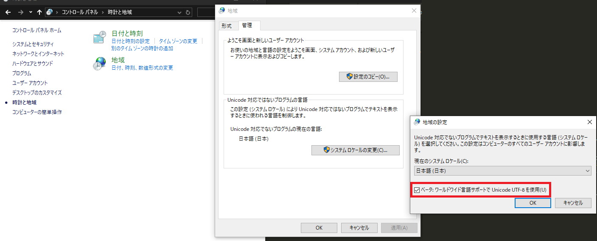

## 要約

* [Synfig Studio](https://www.synfig.org/)には、[lottie](https://lottiefiles.com)形式で出力する機能がプラグインとして実装されている (コードでいうと[このへん](https://github.com/synfig/synfig/tree/master/synfig-studio/plugins/lottie-exporter))
* このプラグインはPythonで実行されていて、lottieのプレビュー用のHTMLを出力する際に、JavascriptのコードがUTF-8で書かれているファイルを読み込んで書き込むような処理がある？
* Pythonがシステムのlocaleからデフォルトのエンコード設定を変えるような動きをするので、日本語環境でそのまま使おうとするとShift JISでは読み込めない旨のエラーが発生する
* 回避策として、`コントロール パネル\時計と地域`から「地域」→「システムロケールの変更」→「ベータ: ワールドワイド言語サポートでUnicode UTF-8を使用」にチェックしたら、動作するようになった


「ベータ: ワールドワイド言語サポートでUnicode UTF-8を使用」はこれ

## エラーの詳細

まず、Synfig Studioで発生した具体的なエラーは以下の通り。

* Synfig Studioのver.1.4.5およびver.1.5.3で確認
  * 1.4.5では、「プラグイン」→「Export to lottie format」から実行
  * 1.5.3では、「ファイル」→「Export...」からフォーマットを`Lottie HTML Preview (*.html)`あるいは`Lottie HTML Preview without variable widths (*.html)`を選択して「保存」
* 中心に円を追加しただけの`.sifz`ファイルを使用 (`.sif`ファイルでも同様の結果となった)
* 以下のようなエラーダイアログが表示される (エラー発生箇所の行数だけ異なる)

```text
Traceback (most recent call last):
  File "{installedPath}\share\synfig\plugins\lottie-exporter\lottie-exporter.py", line 167 (1.5.3では"line 147"), in <module>
    out = gen_html(out)
  File "{installedPath}\share\synfig\plugins\lottie-exporter\lottie-exporter.py", line 92 (1.5.3では"line 75"), in gen_html
    bodymovin_script = f.read()
UnicodeDecodeError: 'cp932' codec can't decode byte 0x93 in position 30346: illegal multibyte sequence
```

`f.read()`で`UnicodeDecodeError`が起きているとのことなので、以下のコードの動作を確認してみた。
`utf8.txt`と`shiftJIS.txt`はそれぞれ、`bodymovin_script`という変数から、HTML出力に成功した際の`script`タグの中身を入力した。

```python:encodingTest.py
import locale
print("encoding: ", locale.getencoding())

print("--- utf-8 ---")
try:
  print("start reading")
  utf8File = open("./utf8.txt", "r")
  utf8File.read(-1)
  print("finish reading")
except UnicodeDecodeError as e:
  print("error: ", type(e))
  print("utf-8 error: ", e)
finally:
  utf8File.close()

print("--- shift JIS ---")
try:
  print("start reading")
  shiftJisFile = open("./shiftJIS.txt", "r")
  shiftJisFile.read(-1)
  print("finish reading")
except UnicodeDecodeError as e:
  print("error: ", type(e))
  print("shift JIS error: ", e)
finally:
  shiftJisFile.close()
```

結果として、「ベータ: ワールドワイド言語サポートでUnicode UTF-8を使用」が未設定のときには↓のようになり、

```text
{workingDir}> python .\encodingTest.py
encoding:  cp932
--- utf-8 ---
start reading
error:  <class 'UnicodeDecodeError'>
utf-8 error:  'cp932' codec can't decode byte 0x93 in position 31312: illegal multibyte sequence
--- shift JIS ---
start reading
finish reading
```

チェックを付けると↓のように変わった。

```text
encoding:  cp65001
--- utf-8 ---
start reading
finish reading
--- shift JIS ---
start reading
finish reading
```

ということで、

* `locale.getencoding()`の結果は`cp932`→`cp65001`へ
  * `cp932`はShift JIS規格のエンコーディング (cpは"code page"を意味するらしい)
  * `cp65001`はWindows内でutf-8を表すエンコーディング？ (ちゃんとした情報が見つからなくてよくわかってない)
* `cp932` (Shift JIS) のエンコーディングになっているときには、``'cp932' codec can't decode byte 0x93``という、Synfigで起きているエラーと同じエラーが発生している
* `cp65001` (utf-8？)になっているときには、いずれのファイルもエラーなく読み込めている (Synfigと動作が同じ)

という結果となった。
このことから、やはりPythonの`f.read()`はシステムのロケール情報からデフォルトのエンコーディング設定を変えており、それがSynfig Studioの動作に影響を与えていると見てよさそう。

## Synfigのことを調べててもどうしようもなく、Python (環境) 側で対処しないといけないのは不親切では？

と思ったので、[Synfig](https://github.com/synfig/synfig)にissueとして報告してみた: [#3418](https://github.com/synfig/synfig/issues/3418)

Pythonでファイル読込してるところでエンコーディングを指定すれば、Python側のことは考慮不要になるんだろうなと思ってはいる。
どこを直すべきなのかも頑張ってコード読めばわかる気はするんだよな (このこと考えるにあたってちらっと読んだときには、なんかライブラリ通じて読み込んでる？からよくわかんなくなった)。
なので、「日本語環境のことなんか日本人が直せばいいじゃん」と言われてしまったら、自力で直しにかかってみようかな。
けっこうSynfigのこと好きになってきてるし、OSSにcontributeしてみたいし！
